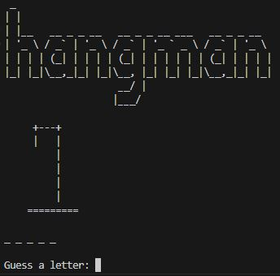

# Python Challenge - Hangman

This is a solution from the challenge based on Day 7 of the [100 Days of Code: The Complete Python Pro Bootcamp](https://www.udemy.com/course/100-days-of-code/) by Dr. Angela Yu.

## Table of contents

- [Overview](#overview)
  - [Screenshot](#screenshot)
  - [Links](#links)
  - [Execution](#execution)
- [My process](#my-process)
  - [Built with](#built-with)
- [Author](#author)

## Overview

### Screenshot

### Links

- Github URL: [https://github.com/valterfabio/python-hangman](https://github.com/valterfabio/python-hangman)

### Execution

To execute the game, just run in the terminal the command `python main.py`

If you want to change the list of words available for the game, you can change the variable `word_list` in the `word.py` file.

## My process

### Built with

- Python 3.10.8

## Author

- Frontend Mentor - [@valterfabio](https://www.frontendmentor.io/profile/valterfabio)
- Github - [valterfabio](https://github.com/valterfabio)
